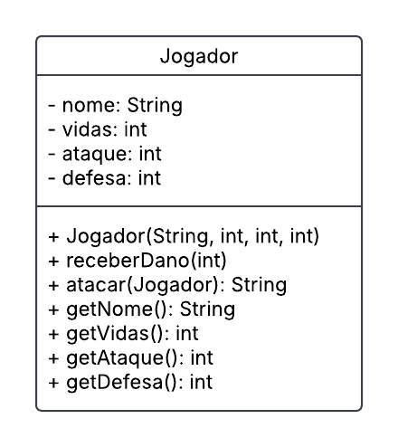

# Projeto Batalha RPG

Este é um projeto de exercício da aula de Programação Orientada a Objetos (POO) do Senac.

## Descrição

O objetivo do projeto é criar uma aplicação de batalha entre jogadores. O aluno deve implementar a classe `Jogador` e completar a classe `BatalhaController`.

## Requisitos

### Classe Jogador

- Deve possuir os seguintes atributos:
    - `nome` (String)
    - `vida` (int)
    - `ataque` (int)
    - `defesa` (int)
- Deve possuir um construtor que inicializa todos os atributos.
- Deve possuir os seguintes métodos:
    - `atacar(Jogador inimigo)`: realiza um ataque ao inimigo. O método calcula o dano com base no atributo de ataque do jogador e a defesa do inimigo (ataque - defesa). Há uma chance de 10% de causar um ataque crítico, que dobra o dano. O dano é então aplicado ao inimigo, e o método retorna uma mensagem indicando o resultado do ataque. As mensagens devem ser como (Fulano atacou Ciclano e causou 10 de dano) ou (ATAQUE CRITICO! Fulano atacou Ciclano e causou 20 de dano).
    - `receberDano(int dano)`: este método é responsável por reduzir a vida do jogador com base no dano recebido. O método deve subtrair o valor do dano do atributo `vida` do jogador. Se a vida do jogador resultar em um valor negativo após a subtração, ela deve ser ajustada para zero, garantindo que a vida do jogador nunca seja negativa. O método não retorna nenhum valor.
    - Métodos getters para todos os atributos.




### Classe BatalhaController

- Siga as instruções nos comentários para desenvolver o funcionamento do controller.

## Instruções para Rodar o Projeto

1. Clone o repositório:
     ```bash
     git clone <URL_DO_REPOSITORIO>
     ```
2. Navegue até o diretório do projeto:
     ```bash
     cd /Users/joaocarloslima/dev/senac/poo/batalha
     ```
3. Compile o projeto:
     ```bash
     mvn clean install
     ```
4. Execute a aplicação:
     ```bash
     mvn spring-boot:run
     ```

## Critérios de Avaliação

- Implementação correta da classe `Jogador` com todos os atributos e métodos especificados.
- Completar a classe `BatalhaController` com todos os endpoints e funcionalidades descritas.
- Funcionamento correto da aplicação conforme os requisitos.
- Código bem estruturado e organizado.
